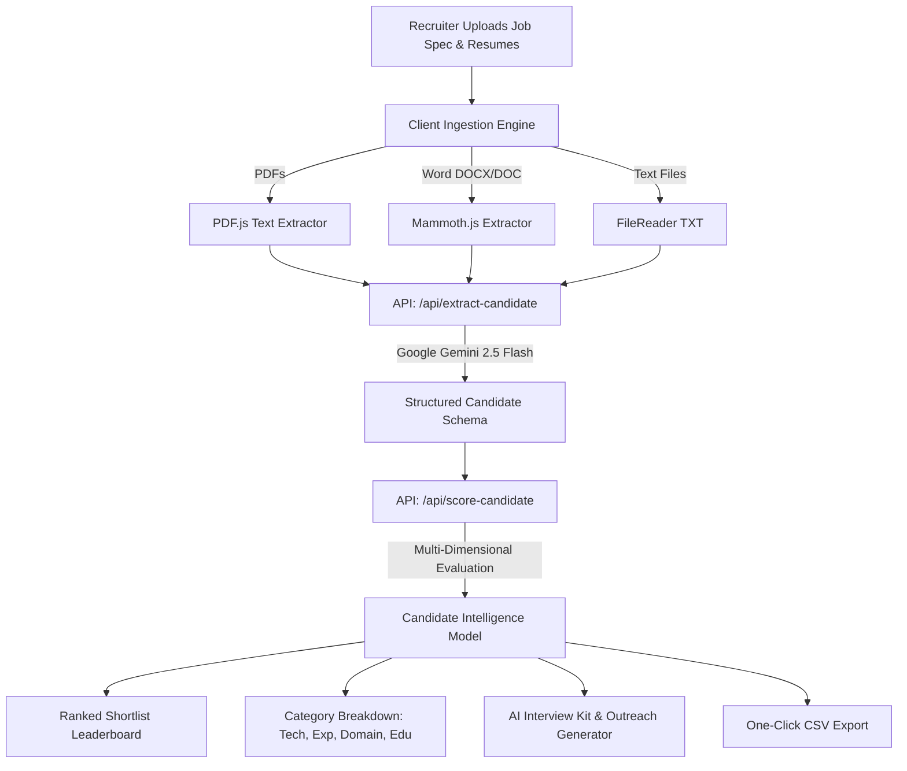

# TalentAI — Neural AI Candidate Screener & Recruitment Bot

> **Next-generation AI recruitment intelligence designed to parse unstructured resumes (PDF, DOCX, TXT), evaluate candidates with multi-dimensional semantic scoring, and auto-generate tailored recruiter interview kits.**

[](https://recruitment-bot-pi.vercel.app/)
[](https://github.com/olamideolanrewaju129-sketch/recruitment-bot)
[](https://nextjs.org/)
[](https://ai.google.dev/)

---

## 🌟 Live Links & Repository

- **🌐 Live Web Application:** [https://recruitment-bot-pi.vercel.app/](https://recruitment-bot-pi.vercel.app/)
- **💻 GitHub Source Code:** [https://github.com/olamideolanrewaju129-sketch/recruitment-bot](https://github.com/olamideolanrewaju129-sketch/recruitment-bot)

---

## 💡 The Problem & The Solution

### The Challenge
Recruiters and hiring managers spend an average of **6 to 8 hours per job opening** manually reading hundreds of unstructured resumes across varying formats (.pdf, .docx, .txt). Traditional keyword applicant tracking systems (ATS) often fail because they lack semantic understanding—missing top candidates who describe their experience with synonyms or nuance.

### The Solution: TalentAI Bot
TalentAI uses **Google Gemini 2.5 Flash** to provide deep semantic evaluation of candidate profiles against exact job requirements. It performs zero-loss multi-format document ingestion, calculates granular multi-dimensional scores, generates custom interview questions based on candidate skill gaps, and prepares personalized recruiter outreach emails in seconds.

---

## 🚀 Key Features

### 1. 📄 Multi-Format Resume Ingestion (.PDF, .DOCX, .DOC, .TXT)
- Direct client-side text extraction using **Mammoth.js** (Word documents) and **PDF.js** (PDFs).
- Instant multi-file upload support—drop 10+ resumes simultaneously with zero formatting loss and no server storage requirement.

### 2. 🎯 Multi-Dimensional Candidate Scoring
Evaluates candidates across 4 core dimensions rather than just a single score:
- **Technical Skills Fit (0–100%):** Matching specific programming languages, frameworks, and tools.
- **Experience Seniority (0–100%):** Verifying required years of production experience and career progression.
- **Domain & Tech Stack Fit (0–100%):** Relevance to role responsibilities and domain context.
- **Education & Certifications (0–100%):** Verification of degrees and industry credentials.

### 3. 🛠️ Recruiter Supertools (AI Interview Kit & Outreach Generator)
- **Tailored AI Interview Questions:** Automatically generates 3 custom behavioral & technical questions targeting the candidate's exact background and flagged skill gaps, with 1-click copy buttons.
- **Personalized Recruiter Outreach:** Auto-drafts an introductory outreach message highlighting the candidate's strongest points.
- **Side-by-Side Candidate Comparator:** Head-to-head modal comparing top candidates on match scores, top strengths, and gaps.
- **One-Click CSV Export:** Export ranked candidate shortlists with scores, notes, and metrics for team review.

### 4. ⚡ Resilient AI Cascade & Live Demo Presets
- **Multi-Model Cascade:** Backed by Google Gemini models (`gemini-2.5-flash`, `gemini-2.0-flash`, `gemini-1.5-flash`).
- **Fail-Safe Heuristic Engine:** Includes a smart entity extraction & semantic fallback engine to ensure 100% uptime during live presentations even during network interruptions.
- **Interactive 1-Click Role Presets:** Test pre-loaded roles (*Senior Full-Stack AI Engineer*, *Lead AI Product Manager*) with mock candidate resumes instantly without uploading manual files.

---

## 🏗️ Architecture & Workflow



---

## 🛠️ Technology Stack

| Layer | Technologies |
|---|---|
| **Framework** | [Next.js 16 (App Router)](https://nextjs.org/) with Turbopack |
| **Language** | [TypeScript 5](https://www.typescriptlang.org/) |
| **UI & Styling** | [Tailwind CSS v4](https://tailwindcss.com/), Google Fonts (`Space Grotesk`, `Inter`) |
| **AI / LLM Engine** | [Google Gemini 2.5 Flash API](https://ai.google.dev/) (`@google/genai`) |
| **Document Parsers**| [Mammoth.js](https://www.npmjs.com/package/mammoth) (DOCX), [PDF.js-dist](https://www.npmjs.com/package/pdfjs-dist) (PDF) |
| **Deployment** | [Vercel](https://vercel.com/) |

---

## 💻 Getting Started Locally

### Prerequisites
- **Node.js**: v18.18.0 or higher (v20+ recommended)
- **npm** / **pnpm** / **yarn**
- **Google Gemini API Key**: Get a free API key from [Google AI Studio](https://aistudio.google.com/).

### Installation

1. **Clone the repository:**
   ```bash
   git clone https://github.com/olamideolanrewaju129-sketch/recruitment-bot.git
   cd recruitment-bot
   ```

2. **Install dependencies:**
   ```bash
   npm install
   ```

3. **Configure Environment Variables:**
   Create a `.env.local` file in the root directory:
   ```env
   GEMINI_API_KEY=your_google_gemini_api_key_here
   ```

4. **Start the Development Server:**
   ```bash
   npm run dev
   ```
   Open [http://localhost:3000](http://localhost:3000) in your browser.

5. **Build for Production:**
   ```bash
   npm run build
   npm run start
   ```

---

## 🔌 API Endpoints Reference

### 1. `POST /api/extract-candidate`
Extracts structured candidate data from unstructured resume text.
- **Request Body:** `{ "resumeText": "..." }`
- **Response:**
  ```json
  {
    "fullName": "Alex Rivera",
    "yearsOfExperience": 6,
    "skills": ["Next.js", "TypeScript", "Google Gemini API", "TailwindCSS"],
    "education": "B.S. in Computer Science - UC Berkeley",
    "certifications": [],
    "tools": ["Docker", "Git", "PostgreSQL"],
    "summary": "Senior Full-Stack Engineer with 6 years experience..."
  }
  ```

### 2. `POST /api/score-candidate`
Scores an extracted candidate profile against a target job description.
- **Request Body:** `{ "jobDescription": "...", "candidate": { ... } }`
- **Response:**
  ```json
  {
    "matchScore": 95,
    "matchLevel": "Strong",
    "reasoning": "Candidate demonstrates 6+ years experience and deep Next.js & AI API knowledge...",
    "missingSkills": ["Vector database production scaling"],
    "strengths": ["6+ years full-stack Next.js production experience", "Gemini API integration"],
    "matchedSkills": ["NEXT.JS", "TYPESCRIPT", "GEMINI", "POSTGRESQL"],
    "categoryScores": {
      "technical": 96,
      "experience": 95,
      "domain": 92,
      "education": 90
    },
    "suggestedInterviewQuestions": [
      "Can you describe how you architected production features using the Gemini API?",
      "How would you approach ramping up on vector databases for RAG search?"
    ],
    "outreachEmailDraft": "Hi Alex, I was impressed by your 6+ years of full-stack experience..."
  }
  ```

### 3. `POST /api/test-gemini`
Health check endpoint to test Gemini API connectivity.

---

## 🏆 Hackathon Evaluation Criteria Alignment

| Criteria | How TalentAI Excels |
|---|---|
| **Innovation** | Auto-generates candidate-specific interview kits targeting verified skill gaps and personalized outreach drafts. Side-by-side comparative matrix. |
| **Technicality** | Multi-model Gemini cascade, multi-format client-side parser (PDF/DOCX/TXT), multi-dimensional scoring algorithms, and robust heuristic fallback. |
| **User Experience** | Instant demo presets, real-time 4-step progress visualizer, responsive ranking cards, one-click CSV export, and accessible typography. |
| **Storytelling** | Clear recruiter ROI: reduces resume screening time from hours to seconds with objective, explainable metrics. |

---

## 📄 License & Attribution

Built by [Olamide Olanrewaju](https://github.com/olamideolanrewaju129-sketch) for modern recruitment and talent acquisition workflows.

- **GitHub:** [@olamideolanrewaju129-sketch](https://github.com/olamideolanrewaju129-sketch)
- **Live Deployment:** [recruitment-bot-pi.vercel.app](https://recruitment-bot-pi.vercel.app/)
